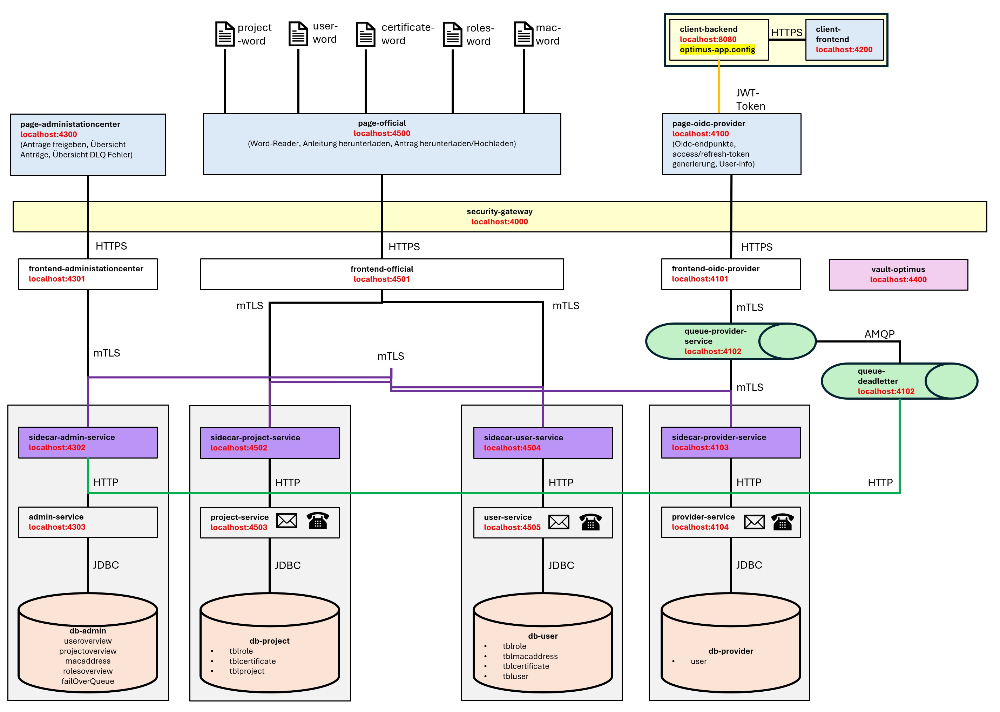

# 🔐 OptimusSecurity

## 📘 Inhaltsverzeichnis

- [Überblick](#überblick)
- [Features](#features)
- [Registrierungsablauf](#registrierungsablauf)
- [Sicherheitsmechanismen](#sicherheitsmechanismen)
- [Technologie-Stack](#technologie-stack)
- [Testkonzept](#testkonzept)
- [Dokumentation](#dokumentation)
- [Lizenz & Kontakt](#lizenz--kontakt)

---

## 🚀 Überblick

**OptimusSecurity** ist ein hochmodernes OIDC-Provider-Tool, das durch seine vollständig automatisierte, mehrstufige Sicherheitslösung überzeugt. Mit intuitiver Benutzerführung und papierloser Registrierung hebt es die Sicherheitsverwaltung auf ein neues Niveau.

---

## ✨ Features

- 📎 **Papierlose Registrierung**
- 🛡️ **Automatische Zertifikatsgenerierung**
- 🔑 **JWT & Refresh Tokens für Sessions**
- 💻 **Hardwarebindung an spezifisches Gerät via Mac Adresse**
- 🪪 **Zwei-Faktor-Authentifizierung (SMS & E-Mail)**
- 🍪 **Strikt konfigurierte Browser-Cookies**
- 🔑 **mTLS Verbindungen zwischen Sidecar-Projekten**
- 🔑 **Zentraler Security-Vault**
- 🔑 **Zentraler Security-Gateway**

---

## 📝 Registrierungsablauf

1. ⬇️ Word-Dokument von [offizieller Website](https://localhost:4500) herunterladen
2. 🧾 Elektronisch ausfüllen und wieder hochladen
3. 👥 Freigabe nach individueller Prüfung im Admin-Tool durch Optimus-Security Mitarbeiter
4. 🧪 Automatische Generierung von Zertifikat und Schlüsseln
5. 📬 Verschlüsseltem Erstanmelde-Key per Email, Passwort via SMS. Erstanmeldung zwingt Benutzer zum Passwortwechsel
6. 📧 Login nur mit E-Mail und Passwort, in Kombination mit einem registrierten Gerät und Code Bestätigung aus Email oder SMS.

---

## 🧷 Sicherheitsmechanismen

| Mechanismus                        | Beschreibung                                                               |
|------------------------------------|----------------------------------------------------------------------------|
| 🔐 Anmeldebestätigung via Mail    | Hardware-gebunden, Mail Bestätigungscode bei Anmeldung notwendig           |
| 📱 SMS-Passwort                   | Zugang zu verschlüsseltem Stick exklusiv für registrierten Benutzer        |
| 📧 E-Mail-Einmalpasswort          | Nutzung ausschließlich bei eingestecktem Stick und korrektem Gerät         |
| 🔄 Token-Verwaltung               | Initialtoken + Refresh-Token für kontinuierliche Sitzungen (max. 5x)       |
| 🍪 Sicher konfigurierte Cookies   | HttpOnly, Secure, SameSite: strenger Schutz der Sitzungsdaten              |

---

## 🛠️ Technologie-Stack

### 💻 Web-Apps
- 🔷 **3 Angular Projekte** *(non-module)*
- ☕ **10 Projekte (SpringBoot Java 21)**
- 🗄️ **1 Security-Gateway (SpringBoot Java 21)**
- 🗄️ **1 Vault (SpringBoot Java 21)**
- 🗄️ **2 Queues (RabbitMQ, SpringBoot Java 21)**
- 🗄️ **4 Datenbanken (H2, JPA, Hibernate, SpringBoot Java 21)**
- 🗄️ **3 Projekte versenden Emails und SMS Nachrichten (SpringBoot Java 21)**

### 🔌 Architecture
- 🔄 **SpringBoot-Microservices**

### 🔐 Auth-Komponenten
- 🧩 **OIDC-Provider**
- 🔗 **OIDC-Properties**

### ⚙️ Batch-Anwendungen
- 📈 **SpringBatch-Projekte (Java 21)**

---

## 🔬 Testkonzept

- 🧪 **>100 Unit-Tests & JUnit**
- 🧪 **Certificate-Tests, Keystore/Truststore-Tests**
- 👀 **1 Selenium (GUI, Penetration, Bots)**
- 🧹 **1 DataQuality-Tests**
- 🚀 **1 JMeter (Last- & Performancetests)**

---

## 🧰 DevOps & Tools

- 🧪 **local-nexus**
- 🐳 **Docker & Docker-Compose**
- 🔗 **Git & GitHub**

---

## 📚 Dokumentation

- 📄 Konzepte & UML-Diagramme
- 🧭 Benutzerhandbücher
- 🎥 Einführungsvideos
- 🗃️ Ausführliche API-Dokumentation via Maven

---

## 📄 Lizenz & Kontakt

Dieses Projekt wird betrieben und verwaltet von **rhiltbrunner / OptimusSecurity**.

---
